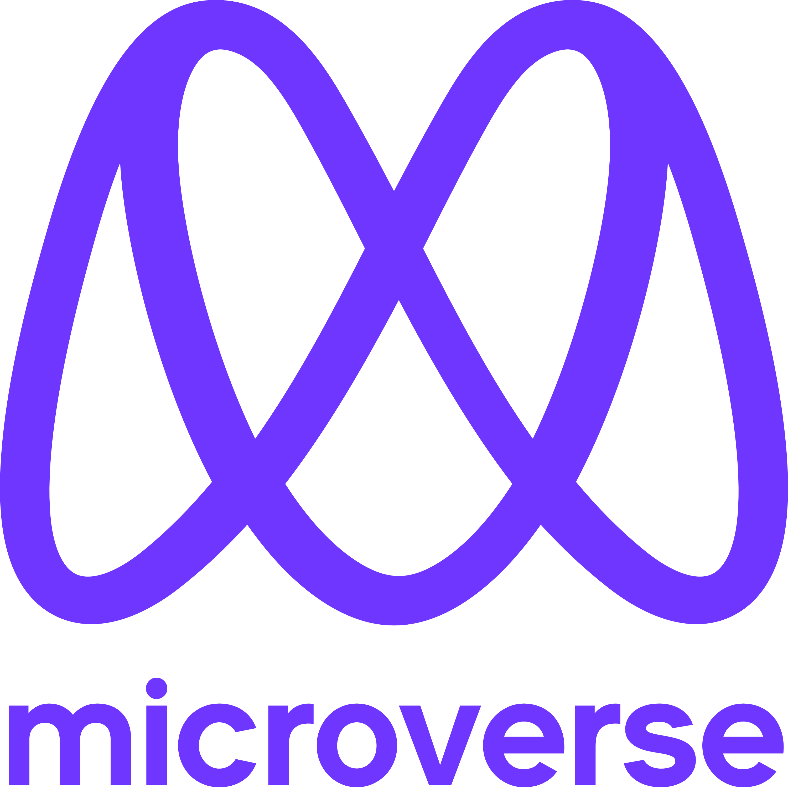

  
   

  <h3><b>My Portfolio Project</b></h3>

<!-- TABLE OF CONTENTS -->

# 📗 Table of Contents

- [📖 About the Project](#about-project)
  - [🛠 Built With](#built-with)
    - [Tech Stack](#tech-stack)
- [👥 Authors](#authors)

<!-- PROJECT DESCRIPTION -->

# 📖 My_Portfolio_Project 

> This is the second project in Microverse week 1.

**[My_Portfolio_Project]** is a HTML and CSS based project.

## 🛠 Built With 

### Tech Stack 

> HTML, CSS and Linter template

  
Client

  <ul>
    <li><a href="https://reactjs.org/">React.js</a></li>
  </ul>

  
Server

  <ul>
    <li><a href="https://expressjs.com/">Express.js</a></li>
  </ul>

Database

  <ul>
    <li><a href="https://www.postgresql.org/">PostgreSQL</a></li>
  </ul>

(<a href="#readme-top">back to top</a>)

<!-- AUTHORS -->

## 👥 Authors 

> Kaung Myat Kyaw (Barry) and Fitz Gerald.

👤 **Author1**

- GitHub: [@githubhandle](https://github.com/Rhaegar121)
- LinkedIn: [LinkedIn](https://www.linkedin.com/in/kaung-myat-kyaw-391720227)

👤 **Author2**

- GitHub: [@githubhandle](https://github.com/fitz95)

(<a href="#readme-top">back to top</a>)

